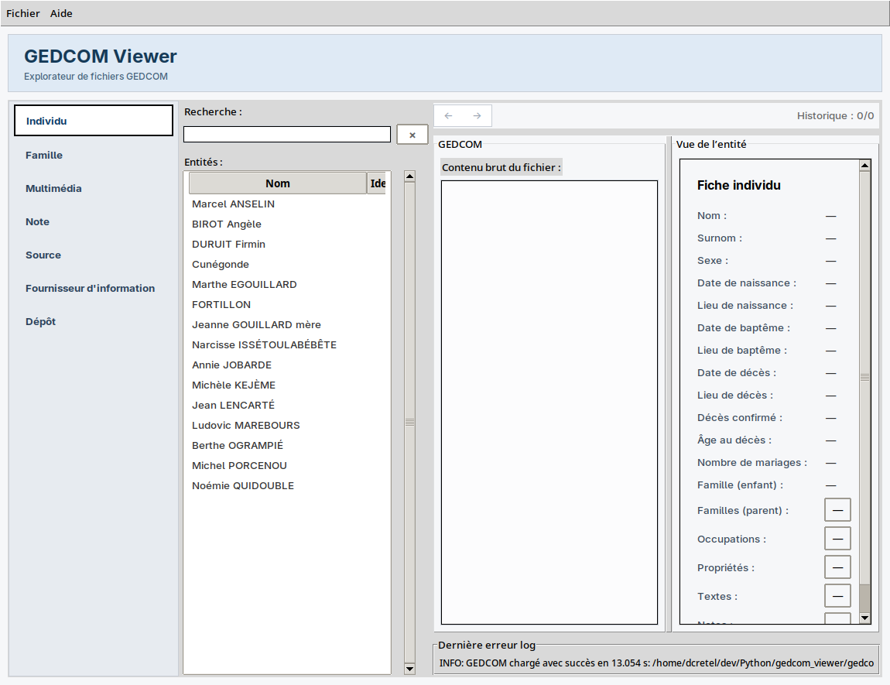

# GEDCOM Viewer 5.5.1

<p align="center">
  
</p>

GEDCOM Viewer est une application de bureau Python/Tkinter pour ouvrir et explorer des fichiers GEDCOM.

## Fonctionnalités

- Ouverture de fichiers GEDCOM `.ged`.
- Deux modes d'ouverture : tolérant ou strict avec validation structurelle.
- Liste des entités par type : `INDI`, `FAM`, `SOUR`, `REPO`, `NOTE`, `OBJE` et `SUBM`.
- Recherche instantanée dans les entités.
- Tri par nom, titre ou identifiant, avec tri numérique des pointeurs.
- Navigation entre les pointeurs GEDCOM tels que `@I1@` ou `@F1@`.
- Historique de navigation précédent/suivant.
- Affichage du bloc GEDCOM brut avec coloration syntaxique.
- Affichage des blocs `HEAD` et `TRLR`.
- Gestion des fichiers récemment ouverts.
- Vues détaillées pour les individus, familles, sources, dépôts, notes, médias et submitters.
- Prévisualisation des images locales dans l'onglet multimédia avec Pillow.
- Journalisation dans `~/.gedcom_viewer.log`.
- Affichage du temps de chargement dans la barre de statut.
- Signalement dans le journal des lignes malformées et des caractères remplacés lors de la lecture.
- Validation structurelle disponible en mode strict via `load(..., strict=True)`.
- Infrastructure d'internationalisation avec le français comme langue par défaut.

L'application est en lecture seule : elle n'édite ni ne sauvegarde les fichiers GEDCOM.

## Architecture

```text
UI Tkinter (ui/)
    -> contrôleurs (controllers/)
        -> service GEDCOM
            -> parser et modèles métier (gedcom/)
```

- `gedcom/` contient le parser et les modèles métier.
- `controllers/` coordonne le chargement, la recherche, le tri et la résolution des pointeurs.
- `ui/` contient la fenêtre principale, les menus, le thème et les vues spécialisées.
- `ui/i18n.py` centralise les traductions de l'interface.
- `tests/` contient les tests unitaires et les tests UI Tkinter.

## Prérequis

- Python 3.x
- Tkinter
- Accès à `pip` pour installer Pillow, PyInstaller et Black

Sur Debian ou Ubuntu, Tkinter peut être installé avec :

```bash
sudo apt install python3-tk
```

## Installation

Le `Makefile` crée automatiquement `.venv` si nécessaire et installe les outils requis :

```bash
make install
```

Cette commande installe :

- Pillow pour la prévisualisation des images ;
- PyInstaller pour la génération de l'exécutable ;
- Black pour le formatage du code.

## Lancement

Avec le script fourni :

```bash
./run.sh
```

Ou directement avec Python :

```bash
python3 main.py
```

Avec l'environnement virtuel du projet :

```bash
.venv/bin/python main.py
```

Au démarrage, l'application tente de recharger le dernier fichier GEDCOM récent lorsqu'il existe encore.

Dans le menu `Fichier`, `Ouvrir un fichier GEDCOM` conserve le mode tolérant.
`Ouvrir et valider un fichier GEDCOM` utilise le mode strict et refuse les
anomalies structurelles détectées. Les fichiers récents sont rechargés en mode
tolérant.

## Tests et vérifications

Exécuter les tests :

```bash
make test
```

Ou directement :

```bash
python3 -m unittest discover -s tests
```

Dernière validation : 82 tests réussis.

Vérifier la syntaxe Python :

```bash
make lint
```

Formater le code avec Black :

```bash
make format
```

## Génération de l'exécutable

Créer une version autonome avec PyInstaller :

```bash
make dist
```

L'exécutable est généré dans :

```text
dist/gedcom_viewer
```

Nettoyer les artefacts de build et l'environnement virtuel :

```bash
make clean
```

Cette commande supprime `build/`, `dist/`, `.venv/` et les répertoires `__pycache__/`.

## Fichiers utilisateur

Les journaux sont écrits dans :

```text
~/.gedcom_viewer.log
```

Les préférences, le répertoire du dernier GEDCOM chargé et la liste des fichiers
récents sont enregistrés dans :

```text
~/.gedcom_viewer.json
```


## Limites connues

- Les gros fichiers sont chargés entièrement en mémoire. Une mesure synthétique sur 100 000 individus a donné environ 1,45 seconde et 169 Mo de mémoire maximale.
- Les événements familiaux sont représentés par le modèle `Event`, mais leur structure reste volontairement simple : un tag, une valeur et une liste de sous-tags.
- Les événements de mariage multiples sont affichés dans la vue famille, mais ne disposent pas encore d'une présentation détaillée dédiée.
- Le parser signale les anomalies, mais ne réalise pas une validation complète de conformité GEDCOM.
- L'ouverture standard reste tolérante ; le mode strict est également accessible dans le menu `Fichier` et via l'API Python.

## Structure du projet

```text
.
├── controllers/
├── gedcom/
│   └── models/
├── ui/
│   └── views/
├── tests/
├── main.py
├── Makefile
├── gedcom_viewer.spec
└── run.sh
```

## Licence et contributions

Aucun fichier de licence n'est fourni dans le dépôt. Les contributions peuvent être proposées via une branche dédiée et une pull request, accompagnées de tests pour les changements de comportement.
