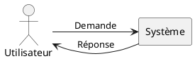

# Documentation

##  1. Table des matières

<!-- vscode-markdown-toc -->
* 1. [Table des matières](#Tabledesmatires)
* 2. [Section 1.1](#Section1.1)
* 3. [Section 1.2](#Section1.2)
* 4. [Section 2.1](#Section2.1)
* 5. [Section 3.1](#Section3.1)

<!-- vscode-markdown-toc-config
	numbering=true
	autoSave=true
	/vscode-markdown-toc-config -->
<!-- /vscode-markdown-toc -->

# Chapitre 1
##  2. Section 1.1
##  3. Section 1.2

# Chapitre 2
##  4. Section 2.1

# Schéma

# Chapitre 3
##  5. Section 3.1